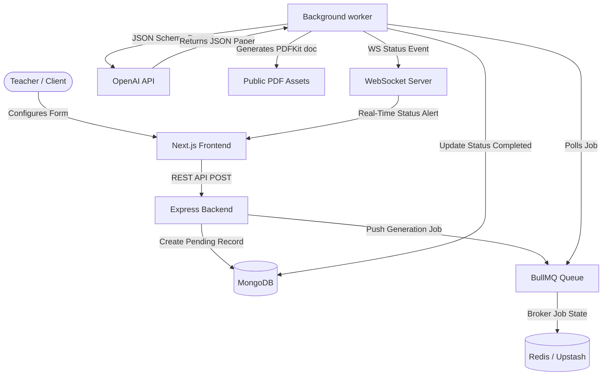

# VedaAI Assessment Creator

VedaAI Assessment Creator is a full-stack academic platform designed for educators to easily configure, generate, preview, and download professional, structured exam question papers and answer keys. 

The application utilizes asynchronous background workers to call OpenAI models using structured JSON schemas, rendering publication-grade PDF papers with corresponding answer sheets.

---

##  Architecture Overview

The system is split into two standalone services: a client-side Next.js frontend and a Node.js/Express backend service backed by MongoDB and Redis.



### 1. Frontend (Next.js App Router)
- **Framework**: Next.js 16 (React 19, TypeScript) built using Turbopack.
- **State Management**: [Zustand](https://github.com/pmndrs/zustand) handles global client states (navigation view, active assignment selections, loaders, and lists).
- **Styling**: Tailwind CSS for custom design system elements (typography, harmony palettes, micro-animations, loaders).
- **Real-Time Integration**: `socket.io-client` listens on the assignment's room ID to receive status transitions (`pending` ➔ `processing` ➔ `completed`/`failed`) instantly.
- **Bypassing Hydration Mismatches**: Bypasses browser-extension hydration overlays (e.g. from DarkReader) by dynamically loading the application shell on the client with SSR disabled.

### 2. Backend (Node.js & Express)
- **Runtime**: Node.js (TypeScript) compiled using `tsc` / `ts-node-dev`.
- **Database**: MongoDB (via Mongoose) to persist assignments, configurations, generated question structures, and PDF paths.
- **Job Queues**: [BullMQ](https://github.com/taskforce-sh/bullmq) manages background job queues for generating questions and PDFs asynchronously, protecting the API from timeout errors.
- **State Broker**: Redis acts as the state database and event broker for BullMQ.
- **Real-time Engine**: Socket.io coordinates room-specific status events back to the client.
- **Document Exporter**: PDFKit builds cleanly aligned, professional PDFs dynamically.

---

##  Implementation Approach & Pipeline

1. **Submission**: The teacher uploads reference material (PDF, image, text) and configures the paper (due date, question counts, marks distribution).
2. **Queueing**: The backend creates a MongoDB document in a `pending` state and adds a `generate-paper` job to the Redis-backed BullMQ.
3. **Execution**:
   - The worker parses uploaded material (e.g., extracting text from PDFs or base64 from images).
   - The worker structures a strict curriculum prompt and makes a call to OpenAI using `response_format: { type: "json_schema" }`. This guarantees the LLM returns a structured JSON matching our strict typescript interface.
4. **Export**: The worker passes the JSON output to the PDF generator to build the document.
5. **Broadcast**: Upon completing the PDF write-stream, the worker updates Mongoose (`status: 'completed'`), and WebSockets broadcast the update. The frontend instantly transitions from a pulsing loading screen to the completed paper view.

---

##  Bonus Features Implemented

### 1. PDF Export Layout
The exporter uses [pdfService.ts](backend/src/services/pdfService.ts) to compile publication-ready exam sheets:
- **Clean Inline Layout**: Formats the question details, difficulty tags, and marks as single paragraph blocks, wrapping cleanly to prevent overlap.
- **Academic Styling**: Includes a top exam banner separated by a classic double-ruled divider line.
- **Student Details Block**: Formats name, roll number, class, and section side-by-side in double columns.
- **Dynamic Marks Calculator**: Calculates and displays the correct **Maximum Marks** dynamically from the generated questions list.
- **Separate Answer Key**: Appends a fresh page dedicated to the generated Answer Key.

### 2. Reliable Queue State & Caching
- Configured BullMQ to run background tasks with a single worker concurrency limit, ensuring OpenAI rate limits are respected during large document parsing.
- Allows instant **Regeneration** of existing papers. Clicking regenerate clears the old assets, resets the status to `pending`, and pushes a fresh job to the queue.

### 3. Mobile Responsiveness
- Implemented responsive viewport stylesheets in `globals.css` with a viewport break at `768px`.
- Converts the static desktop sidebar into a smooth, left-sliding drawer menu overlay with a dark blurred backdrop.
- Rearranges dashboard grid cards, action banners, and exam sheets into single-column responsive sections on mobile viewports.

---

##  Setup & Local Launch

### Prerequisites
- **Node.js** (v18+)
- **MongoDB** (Running locally on `mongodb://localhost:27017` or Atlas)
- **Redis** (Running locally on `127.0.0.1:6379` or via cloud services like **Upstash**)
- **OpenAI API Key**

---

### Step 1: Backend Setup
1. Navigate to the backend directory:
   ```bash
   cd backend
   ```
2. Create your `.env` file from the example:
   ```bash
   cp .env.example .env
   ```
3. Open `.env` and fill in your variables:
   ```env
   PORT=5000
   MONGO_URI=mongodb://localhost:27017/veda-ai
   REDIS_URL=redis://127.0.0.1:6379    # Replace with Upstash URL if not running Redis locally
   OPENAI_API_KEY=your_openai_key_here
   OPENAI_MODEL=gpt-4o-mini
   ```
4. Install dependencies:
   ```bash
   npm install
   ```
5. Start the backend development server:
   ```bash
   npm run dev
   ```

---

### Step 2: Frontend Setup
1. Navigate to the frontend directory:
   ```bash
   cd ../frontend
   ```
2. Install dependencies:
   ```bash
   npm install
   ```
3. Start the Next.js development server:
   ```bash
   npm run dev
   ```
4. Open [http://localhost:3000](http://localhost:3000) in your browser.
